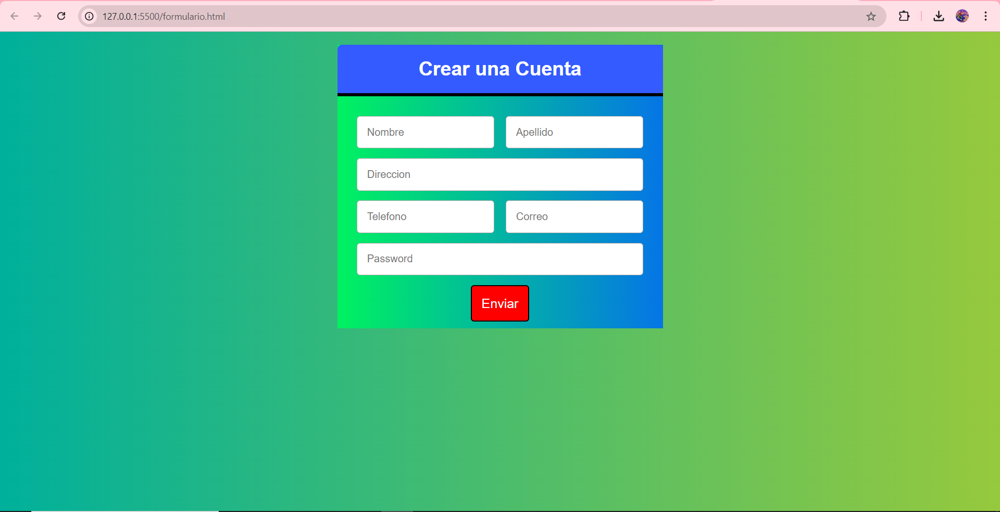

# Formulario basico con Javascript y PHP

Este proyecto usa JS para validar un formlulario y despues utiliza PHP para tomar los valores del formulario y mostrarlos en una nueva vista.

## Requisitos
- PHP v7+
- XAMPP/LAMPP/MAMPP

## Como usarlo

### Clonar el proyecto en tu capeta htdocs
```
git clone 
```

### Acceder a localhost/formulario-php

